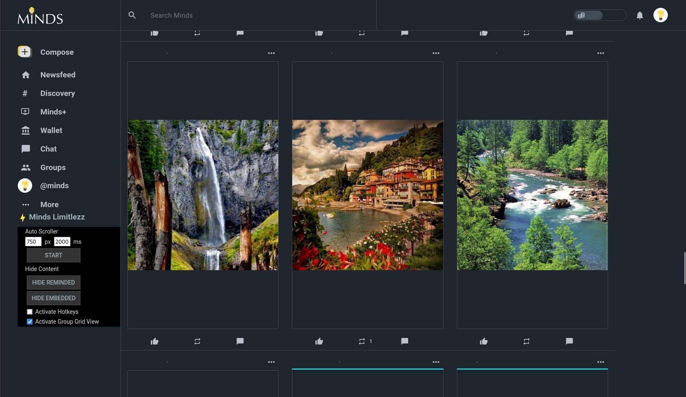

# Change Log

## Version 1.11.0

- feat: remove 'Networks' from sidebar

## Version 1.10.0

- feat: add hide fediverse button

## Version 1.9.4

- fix: item parsing under 'More' submenu

## Version 1.9.3

- fix: styling of text in widget in light mode
- fix: adjust navigation on smaller screen sizes
- feat: hide some text on smaller screens

## Version 1.9.2

- fix: styling of menu items to be calculated from existing items
- feat: remove "Upgrade" menu item

## Version 1.9.1

- fix: hide boosted content onscroll

## Version 1.9

- feat: add grid view to explore section
- feat: add titles to button components
- feat: reorganize the widget components
- feat: add temporary hide boost button
- feat: add onclick action to checkbox labels
- feat: remove sidebar on explore section
- fix: grid view in other sections
- fix: notification menu item style
- deprecated: hide outdated functions

## Version 1.8

- remove unused menu items: boost, affiliate, wallet, supermind, and minds+ and placed them under "More"
- will see items first load only, need to refresh if clicked away by accident
- remove pesky info blocks within feed
- fix search bar styling at head and reduce padding

## Version 1.7

- fix widget height to be full displayed

## Version 1.6

- update code after recent Minds update

## Version 1.5

- minor feature: decrease notification media size

## Version 1.4

- all feeds have access to grid view
- reminded content is denoted as purple in grid view
- text content is denoted as aqua in grid view
- about section in channel feed is removed
- unchecking grid view resets auto scroller
- add button to hide outdated groups

## Version 1.3

- feeds use full width
- content is centralized
- add grid view to groups

## Version 1.2

- can start and stop the *Auto Scroller* with the SPACE key. This needs to be activated first. Make sure to deactivate it to use SPACE as expected.
- can hide reminded content
- can hide embeded content

## Version 1.1

- add Minds Limitlezz widget
- integrate auto scroller feature to widget
- better code structure by using encapsulated function over init

## Version 1.0

- removes boosted content (newfeed)
- removes content on the right (newsfeed)
- expands the feed to fit the full width (newsfeed)
- removes all except media in user gallery grid view
