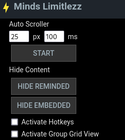

# Minds Limitlezz

Improve your Minds experience.

## Features

### Widget

- Add widget to existing navigation menu on the left
- Able to open and close the widget

#### Auto Scroller

Simple auto scroller that can be altered from the default `100ms` and `25px` scroll speed.

Can start and stop it with SPACE key after activating hotkeys. Make sure to deactivate before typing.

Checking *Activate Group Grid View* will automatically set the values to `2000ms` and `750px`. Unchecking it will reset to default.

### Newsfeed

- Removes boosted content
- Removes content on the right
- Expands the feed to fill the whole page
- Can hide reminded content
- Can hide embedded content
- Can hide media free content, so no text

### Group Pages

- Expands the feed to fill the whole page and centralizes media
- Can view media content in a grid view and removes strings. They are hinted with an aqua line above the media.

### Channel Pages

#### Feed Tab

- Removes about section on the right
- Can be displayed in grid view

#### Gallery Tab

- Removes everything except the media

### Groups Memberships

- Can be displayed in grid view
- While in grid view will highlight new content
- Can hide outdated groups

### Explore Pages

- Can activate grid view on it.

### Side menu

- Is reduced to an opinionated amount.

## Legal notice

This project is not affiliated in any way with Minds.com. 
The user acknowledges that it is their responsibility and not that of the developers of this addon.
