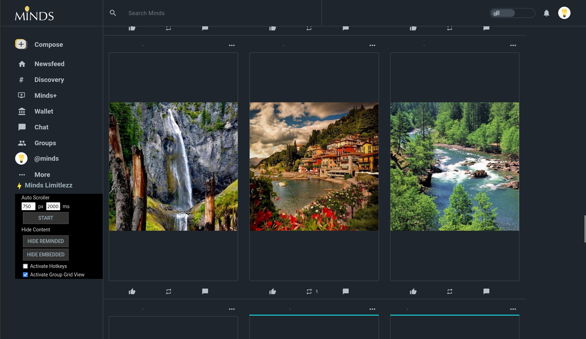

# Minds Limitlezz

Improve your Minds experience.

## Features

### Widget

- Add widget to existing navigation menu on the left
- Able to open and close the widget

#### Auto Scroller

Simple auto scroller that can be altered from the default `100ms` and `25px` scroll speed.

Can start and stop it with SPACE key after activating hotkeys. Make sure to deactivate before typing.

Checking *Activate Group Grid View* will automatically set the values to `2000ms` and `750px`.

### Newsfeed

- Removes boosted content
- Removes content on the right
- Expands the feed to fill the whole page
- Can hide reminded content
- Can hide embedded content

### Group Pages

- Expands the feed to fill the whole page and centralizes media
- Can view media content in a grid view and removes strings. They are hinted with an aqua line above the media.

### User Account Gallery Grid View

- Removes everything except the media

## Legal notice

This project is not affiliated in any way with Minds.com. 
The user acknowledges that it is their responsibility and not that of the developers of this addon.

## Change Log

### Version 1.3

- feeds use full width
- content is centralized
- add grid view to groups

### Version 1.2

- can start and stop the *Auto Scroller* with the SPACE key. This needs to be activated first. Make sure to deactivate it to use SPACE as expected.
- can hide reminded content
- can hide embeded content

### Version 1.1

- add Minds Limitlezz widget
- integrate auto scroller feature to widget
- better code structure by using encapsulated function over init

### Version 1.0

- removes boosted content (newfeed)
- removes content on the right (newsfeed)
- expands the feed to fit the full width (newsfeed)
- removes all except media in user gallery grid view
